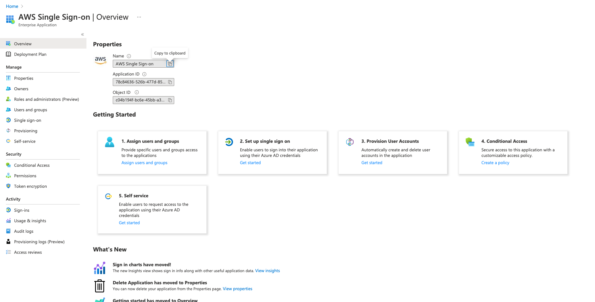
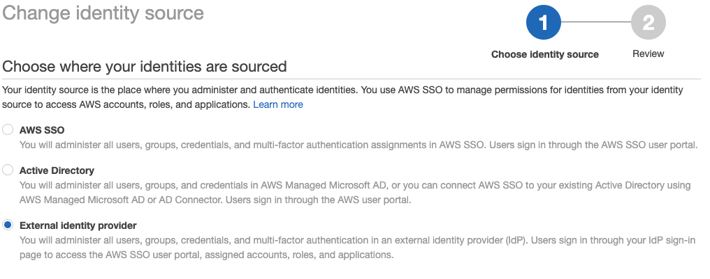
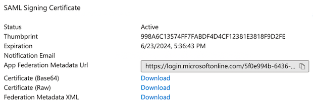
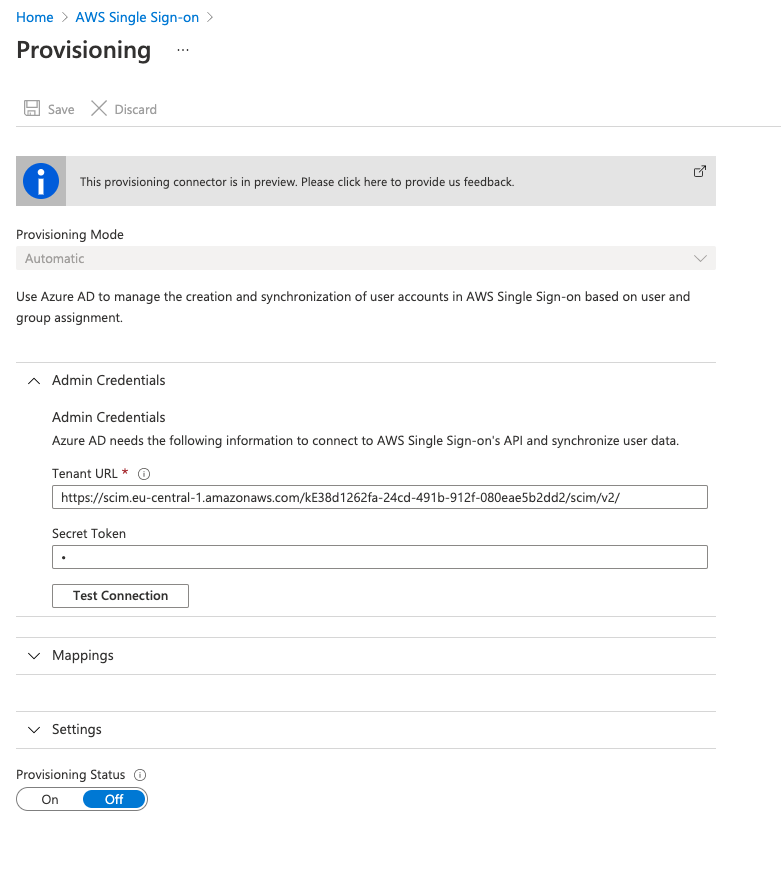
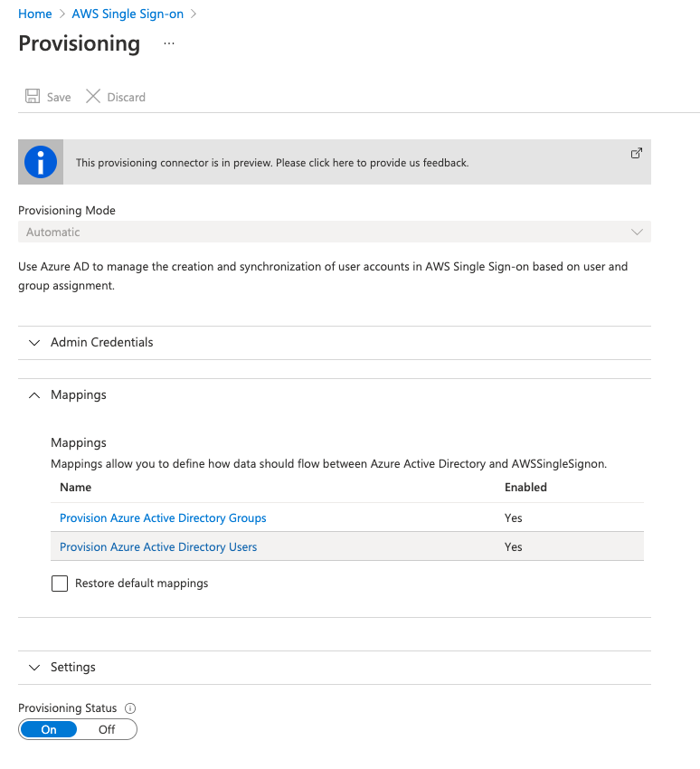
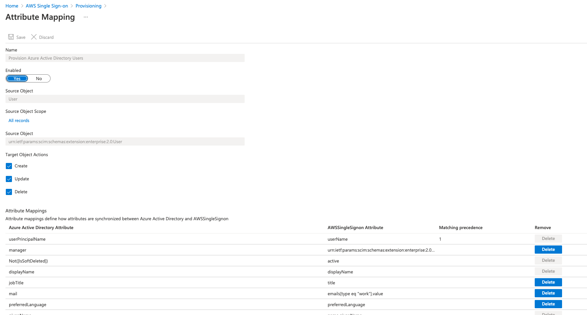
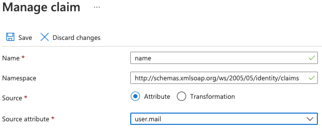
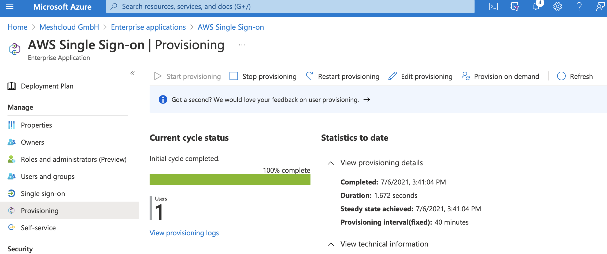

# AAD as IdP for AWS

### Part 1: Azure

### Configure AAD as IdP for AWS SSO

You can trigger everything that is needed for using AAD as an IdP for AWS SSO from within Azure.

### Create an Enterprise Registration

Choose `AWS Single Sign-on` as the enterprise registration type

Follow the steps in AAD under Getting Started (Pick SAML for the single sign on.)

### Part 2: AWS

### **Configure AWS for AAD integration**

Choose`AWS Single Sign-on`

Configure the identity source by clicking on `Choose your identity source`

We have to change the `Identity source`

Select `External identity provider`

### Part 3: Metadata

Download `AWS SSO SAML metadata` and then you should upload it into `Single sing-on` page on Azure with the `Upload metadata file` button. Also check the following image to download `IdP SAML metadata` file from Azure, you can find it in the same page as `Federation Metadata XML`

After downloading the `Federation Metadata XML` from Azure you have to upload this file into your AWS SSO Identity Source under `IdP SAML metadata`

## Part 4: Provisioning

Before the automatic provisioning is enabled, you can click `enable automatic provisioning` on Azure to get the Tenant URL and Access Token to configure SCIM for provisioning on AAD side.

### euid not usable

In AWS SSO lookup of users is only possible via userName, not via email (see [https://docs.aws.amazon.com/singlesignon/latest/developerguide/listusers.html](https://docs.aws.amazon.com/singlesignon/latest/developerguide/listusers.html)). Sadly we can't set userName in AWS SSO to the user's email address as this mapping cannot be changed for the automatic SCIM provisioning in AAD.

You can also disable the Group sync here, as usually only groups managed by meshStack will be used and they will be created by meshStack anyway.

When clicking on the directory users mapping, you will see, that the userprincipalname to userName mapping cannot be deleted.

It would be possible if only meshStack is used for SCIM auto provisioning of users, because for this auto-provisioning we can decide which value to set as userName and we'd use the euid.

In AWS SSO it would also be possible to set username in SAML claims to `user.mail`, so login via AWS SSO would work.

These users will be replicated with Provisioning Settings. You should also configure that so you can see your Users in your AWS SSO directory.

Once you configure that Provisioning, you should click that `Start provisioning` button and it will replicate your Users and Groups into the AWS SSO. After this point this service will replicate the users every 40 minutes however you can always use `Provision on demand` or `Restart provisioning` buttons to run that replication.

